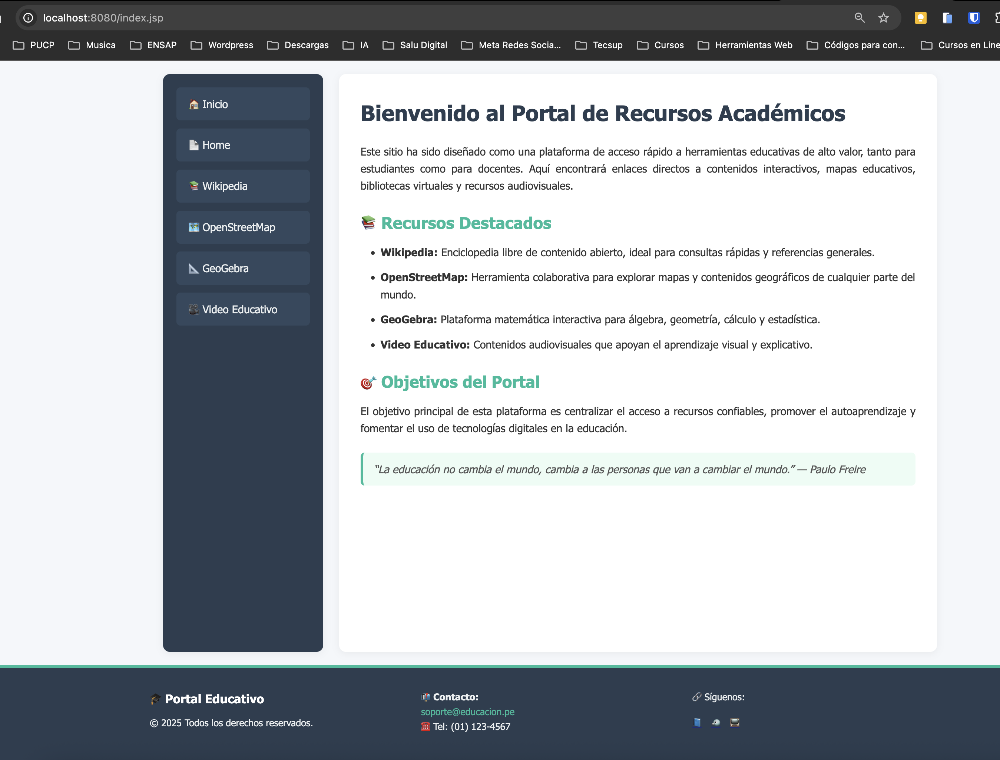
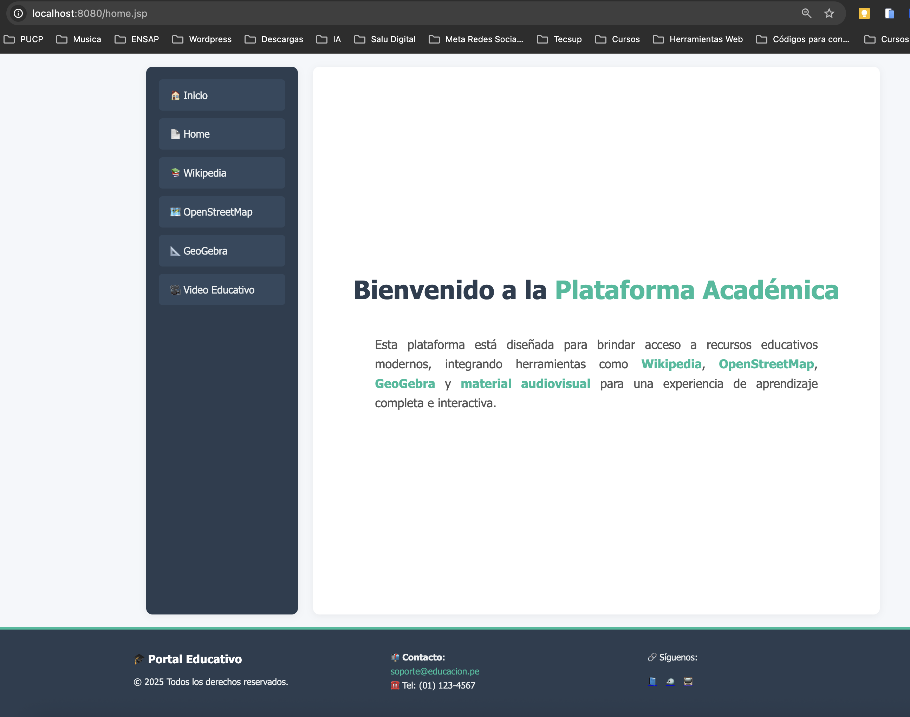
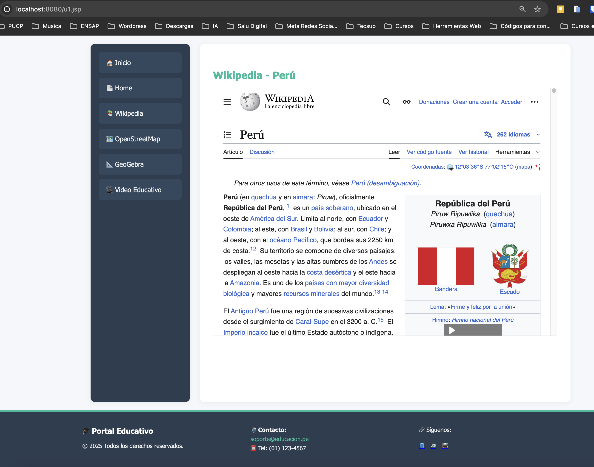
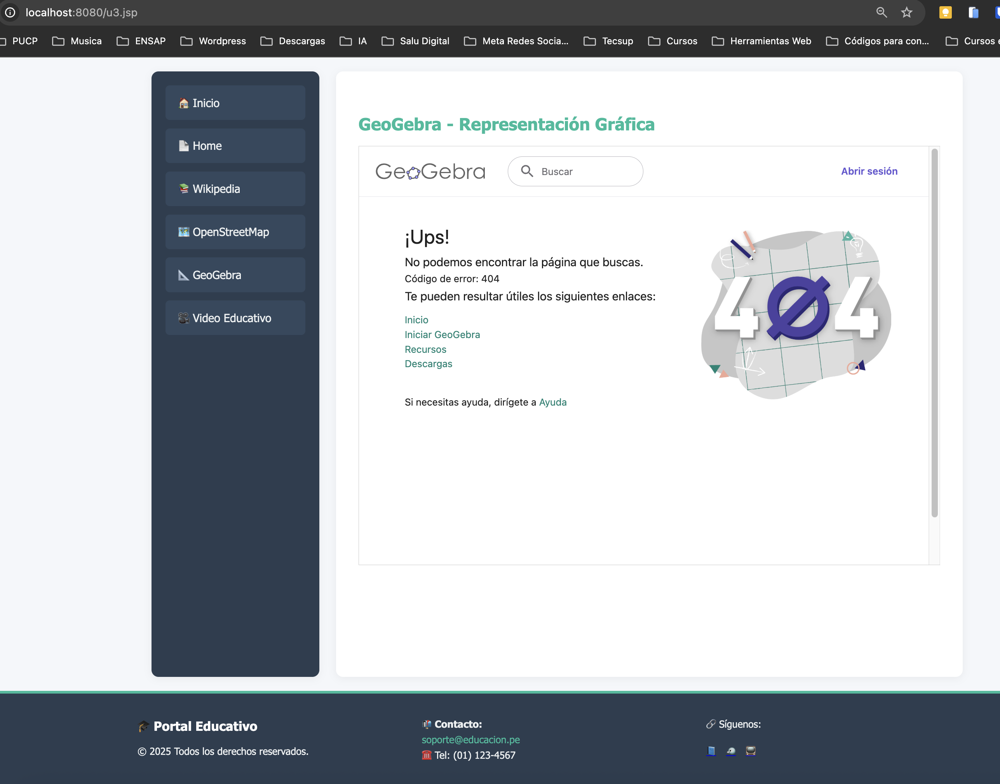
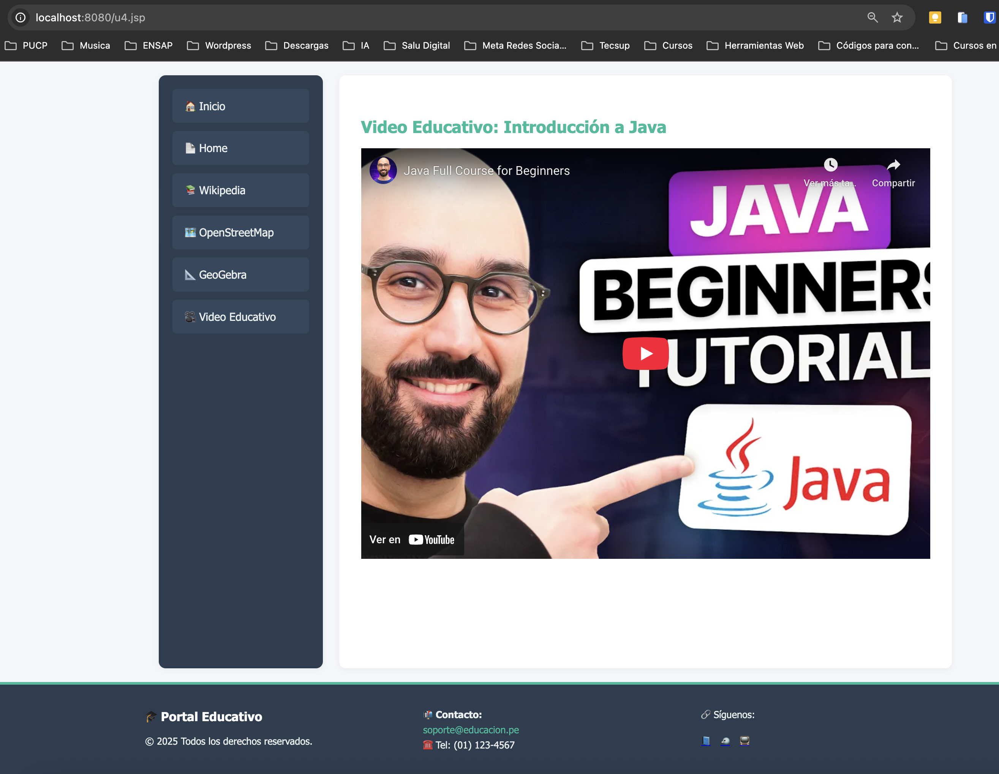

# 🌐 Portal Educativo JSPF - Lab09

Este proyecto es una aplicación web desarrollada con **Java EE (Servlets + JSP)**, que tiene como objetivo proporcionar un portal educativo centralizado con enlaces a recursos de alto valor como enciclopedias, herramientas matemáticas, mapas interactivos y contenido audiovisual. Está diseñado especialmente para el entorno académico, fomentando el autoaprendizaje y el uso de tecnologías digitales en la educación.

## 🔄 Uso de JSPF (JSP Fragmentos)

Para mejorar la mantenibilidad y reutilización del código, se utilizan archivos `.jspf` (JSP fragments). Estos fragmentos permiten **incluir bloques comunes de HTML/JSP** como menús de navegación o pies de página en múltiples páginas del sistema, evitando la duplicación de código.

Por ejemplo:

- `menu.jspf`: Contiene el menú lateral de navegación.
- `pie.jspf`: Contiene el pie de página institucional con contacto y redes sociales.

Estos archivos se integran fácilmente en otras páginas JSP mediante la directiva:

```jsp
<%@ include file="jspf/menu.jspf" %>
<%@ include file="jspf/pie.jspf" %>
```

## 🛠️ Tecnologías utilizadas

- Java 11+
- Servlets y JSP
- Apache Tomcat 10+
- HTML5 y CSS3
- UTF-8 Encoding
- IDE recomendado: IntelliJ IDEA / Eclipse
- Maven (estructura de proyecto)
- JSP Fragmentos (`*.jspf`) para reutilización

## 📁 Estructura del Proyecto

```bash
src/
├── main/
│ ├── java/
│ │ └── styp/com/lab09/
│ │ └── HelloServlet.java
│ ├── webapp/
│ │ ├── WEB-INF/
│ │ │ └── web.xml
│ │ ├── css/
│ │ │ └── main.css
│ │ ├── jspf/
│ │ │ ├── menu.jspf
│ │ │ └── pie.jspf
│ │ ├── index.jsp
│ │ ├── home.jsp
│ │ ├── u1.jsp
│ │ ├── u2.jsp
│ │ ├── u3.jsp
│ │ └── u4.jsp
```


## 🧩 Componentes Clave

- `menu.jspf`: Fragmento reutilizable para el menú de navegación lateral.
- `pie.jspf`: Fragmento de pie de página con información de contacto y redes sociales.
- `index.jsp`: Página principal con descripción del portal, recursos destacados y objetivos.
- `HelloServlet.java`: Servlet básico de ejemplo para manejar solicitudes.
- `web.xml`: Archivo de configuración que registra el servlet y define rutas.

## 📌 Características destacadas

- ✅ Diseño modular usando JSP fragmentos (`*.jspf`)
- ✅ Código organizado en capas: presentación y lógica de control
- ✅ Footer y menú replicables en todas las páginas
- ✅ Uso de emojis y diseño accesible para una interfaz amigable
- ✅ Compatible con navegadores modernos

## 🚀 Cómo ejecutar el proyecto

1. Clona este repositorio:
   ```bash
   git clone https://github.com/tuusuario/portal-educativo-jsp.git
   ```
2. Importa el proyecto en tu IDE como un proyecto Maven (si usas Maven).

3. Asegúrate de tener Apache Tomcat 10+ configurado en tu IDE o standalone.

4. Despliega el proyecto y accede en tu navegador:
    ```bash
    http://localhost:8080/Lab09/index.jsp

    ```
   
5. Los resultados de este proyecto son:


### Página de Inicio


### Enlace Home


### Enlace Wikipedia


### Enlace OpenStreepMap


### Enlace GeoGebra


### Enlace Educativo

